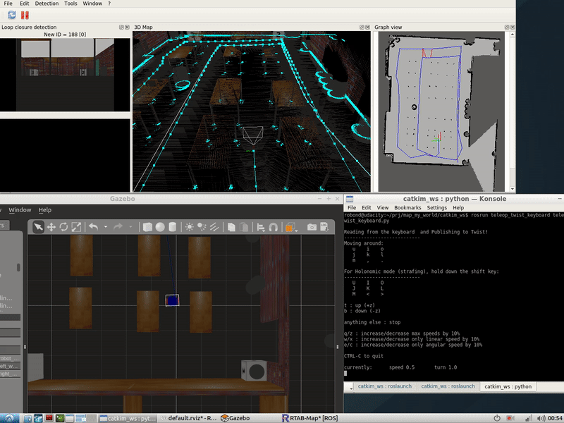
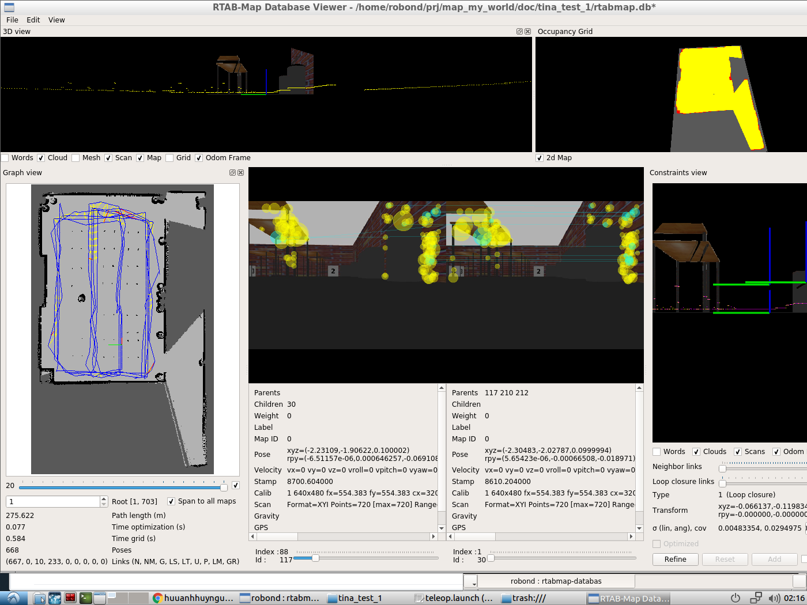
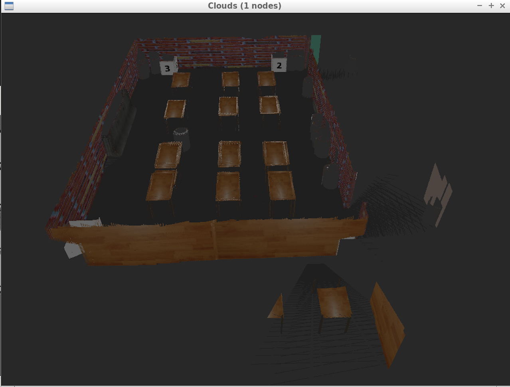
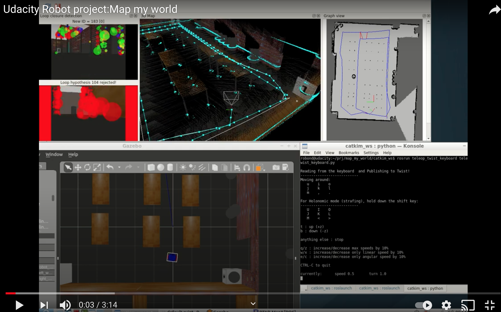

[](https://www.udacity.com/robotics)

# Map my world
Project 4 of the Udacity Robotics Software Engineer Nanodegree. In this project I created a 2D occupancy grid and 3D octomap from a simulated environment using my own robot with the RTAB-Map package.



## Description

RTAB-Map (Real-Time Appearance-Based Mapping) is a popular solution for SLAM (simultaneous localization and mapping) to develop robots that can map environments in 3D. RTAB-Map has good speed and memory management, and it provides custom developed tools for information analysis. Most importantly, the quality of the documentation on ROS Wiki (http://wiki.ros.org/rtabmap_ros) is very high. 

For this project I used the rtabmap_ros package, which is a ROS wrapper (API) for interacting with RTAB-Map. 


1. Develop `rtabmap` node to interface with the rtabmap_ros package.

2. Upgrade sensor by adding an RGB-D camera for localization.

3. Set up rtabmapviz, which is an additional node for real time visualization of feature mapping, loop closures, and more. It’s not recommended to use this tool while mapping in simulation due to the computing overhead. rtabmapviz is great to deploy on a real robot during live mapping to ensure that you are getting the necessary features to complete loop closures.

4. Use teleop to control the robot move around the room to generate a proper map of the environment.


## Prerequisites/Dependencies

1. ROS (Melodic or Kinetic), Gazebo on Linux
    * [Click here for Gazebo download and installation instructions.](http://gazebosim.org/)
    * [Click here for ROS installation instructions.](http://wiki.ros.org/ROS/Installation)

2. CMake & g++/gcc
    * make >= 4.1(mac, linux), 3.81(Windows)
        * Linux: make is installed by default on most Linux distros
        * Mac: [install Xcode command line tools to get make](https://developer.apple.com/xcode/features/)
        * Windows: [Click here for installation instructions](http://gnuwin32.sourceforge.net/packages/make.htm)
    * gcc/g++ >= 5.4
        * Linux: gcc / g++ is installed by default on most Linux distros
        * Mac: same deal as make - [install Xcode command line tools](https://developer.apple.com/xcode/features/)
        * Windows: recommend using [MinGW](http://www.mingw.org/)


## Setup Instructions 
1. Meet the `Prerequisites/Dependencies`  
2. Open Ubuntu Bash and clone the project repository  
3. check update 
```bash
sudo apt-get update && sudo apt-get upgrade -y
```
4. Install teleop package
```bash 
sudo apt-get install ros-kinetic-teleop-twist-keyboard
```
5. Install rtabmap-ros package 
```bash
sudo apt-get install ros-${ROS_DISTRO}-rtabmap-ros
```

## Build and Launch
* Clone this repository
```bash
git clone https://github.com/tinachientw/RoboND-MapMyWorld.git
```
* Open the repository and make  
```bash
cd $PATH_TO_PARENT_DIR/catkin_ws/
catkin_make
```
* Launch the world and robot
```bash
source devel/setup.bash
roslaunch my_robot world.launch
```
* Open another terminal and launch the mapping.launch file. The rtabmap-ros package will be launched.
```bash
$ source devel/setup.bash
$ roslaunch my_robot mapping.launch
```
* Open another terminal, and run the teleop node.
```bash
source devel/setup.bash
rosrun teleop_twist_keyboard teleop_twist_keyboard.py
```
or
```bash
roslaunch my_robot teleop.launch
```
Click on this terminal, type keyboard to navigate the robot around. Navigate the robot to scan its surrounding environment. The rtabmap-ros package will save the resulted map with the localized trajectory of the robot in a database file `~/.ros/rtabmap.db`.

## The RTAB Map Database Files
* Open another terminal, and open up the database file using `rtabmap-databaseViewer`
```bash

$ rtabmap-databaseViewer ~/.ros/rtabmap.db
```
* Choose View -> Constraints View and Graph View
* To see 3D Map, Choose Edit -> View 3D Map ...

The files were too large to host on Github, so I uploaded them to Google Drive and the sharing link is [here](https://drive.google.com/file/d/1V_B1ZRmf8q7onBhussXjg2LzrJOQzBso/view?usp=sharing). Example of the database visualized through RTAB-Map's database viewer:






## The Video
Click on the image to watch the video or click [here](https://youtu.be/2SRxNq7vunY). You will be redirected to YouTube.[](https://youtu.be/2SRxNq7vunY)

## License
Original version of the license of this repository can be found here:
https://gist.github.com/laramartin/7796d730bba8cf689f628d9b011e91d8
